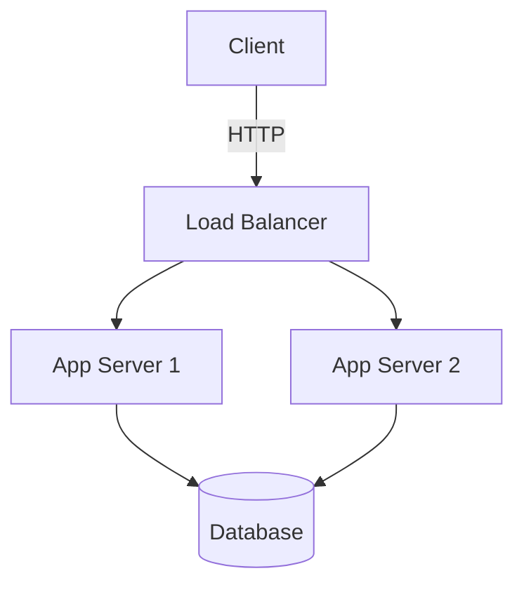
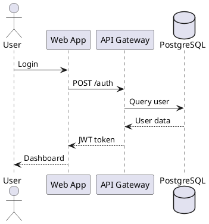

# File Transformation & Conversion System Research 2025

> Comprehensive research on innovative features for a developer-focused file conversion and transformation system

**Research Date:** December 20, 2025
**Target Platform:** Code Bridge (Rust-based P2P File Sharing)
**Focus:** Production-ready tools, libraries, and implementation approaches

---

## Table of Contents

1. [Code Transformation](#1-code-transformation)
2. [Data Format Conversion](#2-data-format-conversion)
3. [Image Processing](#3-image-processing)
4. [Document Conversion](#4-document-conversion)
5. [Media Processing](#5-media-processing)
6. [Developer-Specific Tools](#6-developer-specific-tools)
7. [Implementation Architecture](#7-implementation-architecture)
8. [Integration with Code Bridge](#8-integration-with-code-bridge)
9. [Recommended Tech Stack](#9-recommended-tech-stack)
10. [Sources](#10-sources)

---

## 1. Code Transformation

### 1.1 AST-Based Transformations

#### **ast-grep** ⭐ (Primary Recommendation for Rust)
- **Language:** Rust
- **Description:** Lightweight static analysis and massive scale code manipulation using tree-sitter
- **Key Features:**
  - Intuitive pattern matching that looks like ordinary code
  - jQuery-like API for AST traversal
  - YAML configuration for linting rules
  - Multi-language support via tree-sitter
- **Installation:** `npm`, `pip`, `cargo`, `homebrew`, `scoop`
- **Use Cases:**
  - Code refactoring at scale
  - Custom linting rules
  - Code search and replace with AST awareness
- **Performance:** Utilizes full CPU cores for efficient processing

```rust
// Example: Using ast-grep for code transformation
// Pattern matching for function calls
pattern: "console.log($MSG)"
// Can be replaced with custom logging
```

#### **OXC Project** (JavaScript/TypeScript Toolchain)
- **Language:** Rust
- **Description:** High-performance JavaScript tools collection
- **Components:**
  - Parser (faster than swc, babel)
  - Linter (2-50x faster than ESLint)
  - Formatter
  - Minifier
  - Resolver
- **Benefits:**
  - Performance through rigorous engineering
  - Correctness via conformance testing
  - Modular architecture
  - Clear APIs and documentation

#### **tree-sitter** (Universal Parser)
- **Language:** Rust (bindings available)
- **Features:**
  - Incremental parsing (< 1ms updates)
  - Multi-language support (100+ languages)
  - Error recovery
  - Syntax highlighting
- **Rust Integration:**
  - `tree-sitter` crate for Rust
  - `rust-sitter` for defining grammars in Rust
  - Tree-sitter LSP for editor support

### 1.2 Language Translation Tools

#### **TypeScript to Python Transpilation**
- **2025 Statistics:**
  - 70%+ of codebases mix JS/TS with Python
  - 85-95% code reuse achievable
  - 30-50% reduction in development time
- **Approach:** Parse TypeScript to AST → Transform → Generate Python
- **Tools:**
  - Custom transpilers using tree-sitter
  - LLM-assisted translation (GPT-4, Claude)

#### **Multi-Language Support**
- **Facebook TransCoder:** Trained on 12+ languages
  - C, C#, C++, Go, Java, JavaScript, PHP, Python, Ruby, Rust, Scala, TypeScript
- **Community Tools:** 34+ code transformation projects on GitHub

### 1.3 Code Formatting & Minification

#### **Terser** (JavaScript Minification)
- **Type:** ES6+ JavaScript minifier
- **Usage:** Default in webpack, Angular, Next.js
- **Features:**
  - Variable name shortening
  - Whitespace removal
  - Dead code elimination
  - Tree shaking
- **Note:** Beautification deprecated - use Prettier instead

#### **cssnano** (CSS Optimization)
- **Type:** Modular CSS optimizer
- **Installation:** `npm install -g cssnano-cli`
- **Features:**
  - PostCSS integration
  - 60-75% file size reduction
  - Advanced optimizations

#### **html-minifier-terser** (HTML Minification)
- **Features:**
  - 50+ configuration flags
  - Integrates Terser for inline JS
  - ES6 support
  - Average 60-75% reduction

### 1.4 Rust-Specific AST Tools

```toml
# Cargo.toml dependencies for AST manipulation
[dependencies]
syn = "2.0"              # Rust AST parsing
quote = "1.0"            # Code generation
proc-macro2 = "1.0"      # Procedural macros
tree-sitter = "0.20"     # Multi-language parsing
ast-grep = "0.15"        # AST search/rewrite
```

---

## 2. Data Format Conversion

### 2.1 Core Rust Libraries (Serde Ecosystem)

#### **serde** ⭐ (Foundation)
- **Version:** 1.0+
- **Description:** Zero-overhead serialization framework
- **Key Benefits:**
  - Compile-time code generation (zero runtime overhead)
  - Format-agnostic (works with any data format)
  - Type-safe transformations
  - Extremely fast (compiler-optimized)

```rust
use serde::{Serialize, Deserialize};

#[derive(Serialize, Deserialize, Debug)]
struct Config {
    name: String,
    port: u16,
    database: DatabaseConfig,
}

// Works with JSON, YAML, TOML automatically
let json = serde_json::to_string(&config)?;
let yaml = serde_yaml::to_string(&config)?;
let toml = toml::to_string(&config)?;
```

#### **Format-Specific Crates**

| Format | Crate | Features |
|--------|-------|----------|
| JSON | `serde_json` | Fast, streaming, pretty-print |
| YAML | `serde_yaml` | Human-readable configs |
| TOML | `toml` | Minimal config files |
| XML | `quick-xml`, `serde-xml-rs` | Fast parsing |
| Protobuf | `prost` | Code generation |
| MessagePack | `rmp-serde` | Binary, compact |
| BSON | `bson` | MongoDB format |
| Avro | `apache-avro` | Schema evolution |

### 2.2 Cross-Format Conversion

```rust
// Convert between formats seamlessly
use serde_json::Value as JsonValue;
use serde_yaml::Value as YamlValue;

// JSON → YAML
let json_str = r#"{"name": "app", "port": 8080}"#;
let json: JsonValue = serde_json::from_str(json_str)?;
let yaml = serde_yaml::to_string(&json)?;

// YAML → TOML
let yaml_value: YamlValue = serde_yaml::from_str(&yaml)?;
let toml_value: toml::Value = serde_yaml::from_str(&yaml)?;
```

### 2.3 Format Recommendations (2025)

| Use Case | Primary | Fallback | Why |
|----------|---------|----------|-----|
| Config Files | TOML | YAML | Human-readable, minimal |
| APIs | JSON | MessagePack | Universal, well-supported |
| High-Performance | Protobuf | MessagePack | Binary, 50%+ smaller |
| Human Editing | YAML | JSON | Readable, comments |
| Data Exchange | JSON | Avro | Standard, tooling |

### 2.4 Advanced Tools

#### **Jackson** (JVM/Java)
- **Version:** 3.0.0 GA (October 2025)
- **Formats:** Avro, BSON, CBOR, CSV, Smile, Properties, Protobuf, TOML, XML, YAML
- **Features:** Streaming, data-binding, tree model

#### **Protobuf Considerations**
- **Size:** 50% better compression than JSON
- **Speed:** 3-10x faster serialization
- **Use Cases:** gRPC, high-volume services, microservices
- **Tools:** `prost` (Rust), `protoc` compiler

---

## 3. Image Processing

### 3.1 Modern Format Support (2025)

#### **Format Landscape**
- **AVIF:** 50% better compression than JPEG, 20% better than WebP
  - Browser support: 95%+ (Chrome, Firefox, Safari)
  - Best for: High-res photos, quality-critical images
- **WebP:** 34% smaller than JPEG with same quality
  - Browser support: 95%+
  - Best for: General web images, animations
- **JPEG XL:** Emerging format for archives and power users
  - Progressive adoption in 2025

### 3.2 Rust Image Processing Libraries

#### **image-rs/image** ⭐ (Primary Choice)
```toml
[dependencies]
image = "0.24"  # Supports: AVIF, BMP, DDS, EXR, GIF, HDR,
                # ICO, JPEG, PNG, PNM, QOI, TGA, TIFF, WebP
```

**Features:**
- Native Rust implementations
- Format auto-detection
- Image manipulation (resize, crop, rotate)
- Buffer operations
- Multi-threaded processing with `rayon`

```rust
use image::{ImageFormat, DynamicImage};

// Convert PNG to AVIF
let img = image::open("input.png")?;
img.save_with_format("output.avif", ImageFormat::Avif)?;

// Resize and optimize
let thumbnail = img.resize(800, 600, image::imageops::FilterType::Lanczos3);
thumbnail.save("thumb.webp")?;
```

#### **Specialized Libraries**

| Library | Purpose | Performance Notes |
|---------|---------|------------------|
| `ravif` | AVIF encoding | Almost pure Rust, based on rav1e |
| `cavif-rs` | AVIF creation | Multi-threaded, quality 1-100 |
| `libvips` (via `bimg`) | High-performance | 4x faster than ImageMagick |
| `mozjpeg` | JPEG optimization | Best compression quality |
| `oxipng` | PNG optimization | Lossless compression |

#### **imgc-rs** (CLI Tool in Rust)
```bash
# Batch convert to WebP
imgc-rs webp input/*.png

# Convert to AVIF with quality setting
imgc-rs avif --quality 85 image.jpg

# Parallel processing built-in
```

### 3.3 OCR Text Extraction

#### **leptess** ⭐ (Rust Tesseract Bindings)
```toml
[dependencies]
leptess = "0.14"
```

**Setup:**
```bash
# Ubuntu
sudo apt-get install libleptonica-dev libtesseract-dev clang
sudo apt-get install tesseract-ocr-eng

# Windows: Uses vcpkg automatically
```

**Usage:**
```rust
use leptess::LepTess;

let mut lt = LepTess::new(None, "eng")?;
lt.set_image("document.png")?;

// Extract text
let text = lt.get_utf8_text()?;

// Get HOCR (HTML with bounding boxes)
let hocr = lt.get_hocr_text(0)?;

// TSV output with coordinates
let tsv = lt.get_tsv_text(0)?;
```

**Advanced Features:**
- Multi-language support (100+ languages)
- Page segmentation modes (PSM)
- Confidence scores
- Word/line/paragraph detection
- Support for Tesseract 4.x and 5.x

### 3.4 Batch Processing Architecture

```rust
use rayon::prelude::*;
use image::ImageFormat;

fn batch_convert_to_webp(files: Vec<PathBuf>) -> Result<()> {
    files.par_iter()
        .try_for_each(|path| {
            let img = image::open(path)?;
            let output = path.with_extension("webp");
            img.save_with_format(output, ImageFormat::WebP)?;
            Ok(())
        })
}
```

### 3.5 Metadata Handling

```rust
// Remove EXIF data for privacy
use kamadak_exif::{Reader, Tag};

fn strip_exif(image_path: &Path) -> Result<()> {
    let file = File::open(image_path)?;
    let mut bufreader = BufReader::new(&file);
    let exifreader = Reader::new();
    let exif = exifreader.read_from_container(&mut bufreader)?;

    // Process/remove metadata as needed
    Ok(())
}
```

---

## 4. Document Conversion

### 4.1 Universal Converter: Pandoc

#### **Pandoc** ⭐ (Swiss Army Knife)
- **Description:** Universal document converter
- **Input Formats:** Markdown, reStructuredText, AsciiDoc, Org-Mode, HTML, LaTeX, DocBook, JATS, OPML, etc.
- **Output Formats:** HTML, PDF, DOCX, EPUB, LaTeX, Markdown variants, and 40+ more
- **PDF Engines:** pdflatex, lualatex, xelatex, wkhtmltopdf, weasyprint, prince

```bash
# Markdown to PDF
pandoc input.md -o output.pdf --pdf-engine=xelatex

# Markdown to DOCX with styling
pandoc input.md -o output.docx --reference-doc=template.docx

# HTML to Markdown
pandoc page.html -o output.md

# Batch conversion
for file in *.md; do
  pandoc "$file" -o "${file%.md}.pdf"
done
```

### 4.2 Jupyter Notebook Conversion

#### **nbconvert** (Official Tool)
```bash
# Basic conversion
jupyter nbconvert --to html notebook.ipynb
jupyter nbconvert --to pdf notebook.ipynb
jupyter nbconvert --to markdown notebook.ipynb
jupyter nbconvert --to python notebook.ipynb

# Execute and convert
jupyter nbconvert --to html --execute notebook.ipynb

# Custom templates
jupyter nbconvert --to html --template custom.tpl notebook.ipynb
```

**Supported Formats:**
- HTML (interactive, slides)
- LaTeX/PDF (requires MiKTeX, TeX Live, or MacTeX)
- Markdown
- reStructuredText
- Python script
- Reveal.js slides

#### **Programmatic Conversion (Rust Integration)**
```rust
use std::process::Command;

fn convert_notebook(input: &str, format: &str) -> Result<()> {
    Command::new("jupyter")
        .args(&["nbconvert", "--to", format, input])
        .status()?;
    Ok(())
}
```

### 4.3 PDF to Markdown

#### **marker** (High Accuracy)
- **Description:** Convert PDF to Markdown + JSON with high accuracy
- **Use Case:** Document extraction, content migration
- **Output:** Clean Markdown with structure preservation

### 4.4 ToMarkdown.dev Features
- Markdown → Jupyter Notebook (.ipynb)
- Markdown → LaTeX
- Real-time conversion
- Template support
- Perfect for educational content and tutorials

### 4.5 Rust Implementation Strategy

```toml
[dependencies]
pulldown-cmark = "0.9"   # Markdown parsing
comrak = "0.18"          # GitHub-flavored Markdown
html5ever = "0.26"       # HTML parsing
```

```rust
use pulldown_cmark::{Parser, html};
use comrak::{markdown_to_html, ComrakOptions};

// Markdown to HTML
fn md_to_html(markdown: &str) -> String {
    let parser = Parser::new(markdown);
    let mut html_output = String::new();
    html::push_html(&mut html_output, parser);
    html_output
}

// HTML to Markdown (via external tool or custom parser)
fn html_to_md(html: &str) -> Result<String> {
    // Use pandoc or custom implementation
    Ok(markdown)
}
```

---

## 5. Media Processing

### 5.1 FFmpeg Foundation

#### **FFmpeg** ⭐ (Universal Media Swiss Army Knife)
- **Latest:** Version 2025-12-18 (December 2025)
- **Major Release:** FFmpeg 7.0 "Dijkstra"
- **Codecs:** 100+ audio and video codecs
- **New Feature (2025):** Built-in Whisper AI transcription

**Core Capabilities:**
- Video compression and conversion
- Audio processing and conversion
- Format detection and conversion
- Streaming support
- Hardware acceleration (CUDA, QSV, VCE)

```bash
# Video compression (H.265/HEVC)
ffmpeg -i input.mp4 -c:v libx265 -crf 28 -c:a aac output.mp4

# Convert to WebM
ffmpeg -i input.mp4 -c:v libvpx-vp9 -crf 30 output.webm

# Extract audio
ffmpeg -i video.mp4 -vn -aac audio.aac

# GIF from video
ffmpeg -i input.mp4 -vf "fps=10,scale=480:-1" -t 5 output.gif

# Thumbnail generation
ffmpeg -i video.mp4 -ss 00:00:05 -vframes 1 thumbnail.jpg

# Batch thumbnails
ffmpeg -i video.mp4 -vf fps=1/60 thumb%04d.jpg
```

### 5.2 Audio Transcription (Whisper Integration)

#### **FFmpeg with Whisper** (NEW 2025)
```bash
# Live audio transcription to SRT
ffmpeg -i audio.mp3 -af whisper=model=base subs.srt

# Real-time streaming transcription
ffmpeg -i stream.m3u8 -af whisper=model=medium output.srt
```

**Features:**
- Automatic Speech Recognition (ASR) directly in FFmpeg
- Generate subtitle files (SRT, VTT)
- Live transcription for streaming
- Multiple model sizes (tiny, base, small, medium, large)

### 5.3 Rust FFmpeg Bindings

```toml
[dependencies]
ffmpeg-next = "6.0"      # FFmpeg bindings
symphonia = "0.5"        # Pure Rust audio decoding
```

### 5.4 Audio Processing

#### **Audio Preprocessing for Transcription**
```bash
# Noise reduction
ffmpeg -i input.mp3 -af "highpass=f=200,lowpass=f=3000" clean.mp3

# Normalize volume
ffmpeg -i input.mp3 -af "loudnorm" normalized.mp3

# Remove silence
ffmpeg -i input.mp3 -af silenceremove=1:0:-50dB trimmed.mp3

# Compress for transcription
ffmpeg -i input.mp3 -ar 16000 -ac 1 -c:a pcm_s16le mono.wav
```

#### **Codec Support**
- **Lossless:** FLAC, ALAC, WavPack
- **Lossy:** AAC, MP3, Opus, Vorbis
- **Speech:** AMR, Speex, Opus
- **Legacy:** WMA, ATRAC, Cook

### 5.5 Rust Audio Transcription

#### **whisper-rs** ⭐
```toml
[dependencies]
whisper-rs = "0.15"      # Latest version (2025)
```

**Features:**
- Multi-language (100+ languages)
- Chinese support (Simplified/Traditional)
- CUDA and ROCm/hipBLAS support
- Tracing and logging integration

```rust
use whisper_rs::{WhisperContext, FullParams, SamplingStrategy};

// Load model
let ctx = WhisperContext::new("models/ggml-base.bin")?;

// Configure params
let mut params = FullParams::new(SamplingStrategy::Greedy { best_of: 1 });
params.set_language(Some("en"));
params.set_print_timestamps(true);

// Transcribe (audio must be mono 16-bit WAV)
let mut state = ctx.create_state()?;
state.full(params, &audio_data)?;

// Get results
let num_segments = state.full_n_segments()?;
for i in 0..num_segments {
    let text = state.full_get_segment_text(i)?;
    println!("{}", text);
}
```

#### **SimpleTranscribe-rs** (High-Level API)
- Automatic model downloading
- Audio format validation
- Simplified API for quick integration

### 5.6 Waveform Visualization

```rust
// Using symphonia + plotters
use symphonia::core::formats::FormatOptions;
use plotters::prelude::*;

fn generate_waveform(audio_path: &Path, output_path: &Path) -> Result<()> {
    // Decode audio
    let file = File::open(audio_path)?;
    let mss = MediaSourceStream::new(Box::new(file), Default::default());

    // Generate waveform image
    let root = BitMapBackend::new(output_path, (1920, 400)).into_drawing_area();
    // ... drawing logic

    Ok(())
}
```

---

## 6. Developer-Specific Tools

### 6.1 Docker and Kubernetes

#### **Docker Compose to Kubernetes (Kompose)**
```bash
# Install kompose
curl -L https://github.com/kubernetes/kompose/releases/download/v1.31.2/kompose-linux-amd64 -o kompose

# Convert docker-compose.yml
kompose convert

# Generate JSON instead of YAML
kompose convert -j

# Generate specific resources
kompose convert --deployment --service
```

**Mapping:**
| Docker Compose | Kubernetes |
|----------------|------------|
| services | Deployment + Service |
| volumes | PersistentVolumeClaim |
| build | Separate Dockerfile → image |
| depends_on | initContainers or readinessProbe |
| .env / environment | Secrets + ConfigMap |
| ports | Service + Ingress |

#### **Multi-Stage Builds (2025 Best Practice)**
```dockerfile
# Build stage
FROM rust:1.75 as builder
WORKDIR /app
COPY . .
RUN cargo build --release

# Runtime stage (minimal)
FROM debian:bookworm-slim
COPY --from=builder /app/target/release/app /usr/local/bin/
CMD ["app"]
```

**Benefits:**
- Build heavy, ship light
- 90%+ size reduction
- Improved security (minimal attack surface)

### 6.2 Package Manager Conversions

#### **package.json → requirements.txt**
```javascript
// Node.js script to extract dependencies
const package = require('./package.json');
const deps = Object.entries(package.dependencies);

// Map to Python equivalents
const mapping = {
  'express': 'flask',
  'lodash': 'python-utils',
  'axios': 'requests',
  // ... add more mappings
};
```

#### **Cargo.toml → package.json**
```rust
// Parse Cargo.toml and generate package.json
use toml::Value;
use serde_json::json;

fn cargo_to_package_json(cargo_toml: &str) -> Result<String> {
    let cargo: Value = toml::from_str(cargo_toml)?;

    let package_json = json!({
        "name": cargo["package"]["name"],
        "version": cargo["package"]["version"],
        "description": cargo["package"]["description"],
        "dependencies": {
            // Map Rust crates to npm equivalents
        }
    });

    Ok(serde_json::to_string_pretty(&package_json)?)
}
```

### 6.3 Environment and Secrets

#### **.env → Docker Secrets**
```bash
# Convert .env to docker-compose secrets
while IFS='=' read -r key value; do
  echo "$value" | docker secret create "$key" -
done < .env
```

```yaml
# docker-compose.yml
secrets:
  db_password:
    external: true
  api_key:
    external: true

services:
  app:
    secrets:
      - db_password
      - api_key
```

#### **.env → Kubernetes Secrets**
```bash
# Create secret from .env
kubectl create secret generic app-secrets --from-env-file=.env

# Or generate YAML
kubectl create secret generic app-secrets \
  --from-env-file=.env \
  --dry-run=client -o yaml > secrets.yaml
```

### 6.4 Database Schema Migrations

#### **SQL → ORM Models**
```rust
// Using diesel-cli
diesel migration generate create_users

// Generated migration
CREATE TABLE users (
  id SERIAL PRIMARY KEY,
  email VARCHAR NOT NULL,
  created_at TIMESTAMP NOT NULL
);

// Diesel generates Rust models automatically
table! {
    users (id) {
        id -> Int4,
        email -> Varchar,
        created_at -> Timestamp,
    }
}
```

#### **Schema Comparison Tools**
- **Diesel Migrations** (Rust)
- **Alembic** (Python/SQLAlchemy)
- **Flyway** (Java)
- **Liquibase** (Multi-language)

### 6.5 Config File Translation

```rust
use serde::{Serialize, Deserialize};

#[derive(Serialize, Deserialize)]
struct AppConfig {
    server: ServerConfig,
    database: DatabaseConfig,
}

// Read from any format
fn load_config<P: AsRef<Path>>(path: P) -> Result<AppConfig> {
    let content = std::fs::read_to_string(path)?;
    let ext = path.as_ref().extension().unwrap().to_str().unwrap();

    match ext {
        "toml" => Ok(toml::from_str(&content)?),
        "yaml" | "yml" => Ok(serde_yaml::from_str(&content)?),
        "json" => Ok(serde_json::from_str(&content)?),
        _ => Err("Unsupported format"),
    }
}

// Write to any format
fn save_config<P: AsRef<Path>>(config: &AppConfig, path: P) -> Result<()> {
    let ext = path.as_ref().extension().unwrap().to_str().unwrap();

    let content = match ext {
        "toml" => toml::to_string_pretty(config)?,
        "yaml" | "yml" => serde_yaml::to_string(config)?,
        "json" => serde_json::to_string_pretty(config)?,
        _ => return Err("Unsupported format"),
    };

    std::fs::write(path, content)?;
    Ok(())
}
```

### 6.6 Diagram Generation from Code

#### **Diagram as Code Tools (2025)**

| Tool | Best For | Language | Output |
|------|----------|----------|--------|
| **Mermaid** | Quick docs, GitHub integration | Markdown | SVG, PNG |
| **PlantUML** | Detailed UML diagrams | Plain text | PNG, SVG, PDF |
| **D2** | Aesthetic diagrams | Declarative | SVG, PNG, PDF, PPT |
| **Graphviz** | Graph visualization | DOT | Multiple |

#### **Mermaid** (Most Popular)
```markdown


**Integration:**
- Native GitHub/GitLab support
- VSCode extension
- Embed in Markdown
- Export to images

#### **D2** (Modern Choice)
```d2
# System Architecture
client: Client {
  shape: person
}

lb: Load Balancer {
  shape: hexagon
}

servers: App Servers {
  server1: Server 1
  server2: Server 2
}

db: Database {
  shape: cylinder
}

client -> lb -> servers -> db
```

**Features:**
- TALA layout engine
- Sketch-drawn mode
- Multiple export formats (SVG, PNG, PDF, PowerPoint)
- Most aesthetic output

#### **PlantUML** (Comprehensive UML)


**Note:** PlantUML support being phased out in draw.io (ends 2025 online, 2028 for Confluence/Jira)

#### **AI Integration (2025)**
```python
# Using LLM to generate diagrams
prompt = "Create a Mermaid diagram for a microservices architecture"
response = llm.generate(prompt)

# Output: Mermaid code
# Save and render
```

### 6.7 GraphQL Schema Conversion

#### **Protobuf ↔ GraphQL**

**Tools:**
1. **Google Rejoiner** - Generate GraphQL from Protobuf
2. **protoc-gen-graphql** - Protobuf compiler plugin
3. **go-proto-gql** - Bridge gRPC and GraphQL
4. **proto2graphql** - Schema conversion

```protobuf
// users.proto
message User {
  string id = 1;
  string name = 2;
  string email = 3;
}

service UserService {
  rpc GetUser(UserRequest) returns (User);
}
```

```graphql
# Generated GraphQL schema
type User {
  id: ID!
  name: String!
  email: String!
}

type Query {
  getUser(id: ID!): User
}
```

#### **OpenAPI ↔ GraphQL**
- **OpenAPI Generator:** Generate various outputs from OpenAPI specs
- **Apollo Federation:** Combine multiple GraphQL schemas

---

## 7. Implementation Architecture

### 7.1 Modular Transformation Pipeline

```rust
// Core trait for all transformations
trait Transformer {
    fn input_format(&self) -> &str;
    fn output_format(&self) -> &str;
    fn transform(&self, input: &[u8]) -> Result<Vec<u8>>;
    fn supports_batch(&self) -> bool { false }
}

// Registry pattern
struct TransformRegistry {
    transformers: HashMap<(String, String), Box<dyn Transformer>>,
}

impl TransformRegistry {
    fn register<T: Transformer + 'static>(&mut self, transformer: T) {
        let key = (
            transformer.input_format().to_string(),
            transformer.output_format().to_string()
        );
        self.transformers.insert(key, Box::new(transformer));
    }

    fn transform(&self, input: &[u8], from: &str, to: &str) -> Result<Vec<u8>> {
        let key = (from.to_string(), to.to_string());
        self.transformers
            .get(&key)
            .ok_or("No transformer found")?
            .transform(input)
    }
}
```

### 7.2 Plugin Architecture

```rust
// Dynamic plugin loading
use libloading::{Library, Symbol};

trait TransformPlugin {
    fn name(&self) -> &str;
    fn version(&self) -> &str;
    fn transformer(&self) -> Box<dyn Transformer>;
}

struct PluginManager {
    plugins: Vec<(Library, Box<dyn TransformPlugin>)>,
}

impl PluginManager {
    fn load_plugin<P: AsRef<Path>>(&mut self, path: P) -> Result<()> {
        unsafe {
            let lib = Library::new(path.as_ref())?;
            let constructor: Symbol<fn() -> Box<dyn TransformPlugin>> =
                lib.get(b"create_plugin")?;
            let plugin = constructor();

            self.plugins.push((lib, plugin));
            Ok(())
        }
    }
}
```

### 7.3 Async Processing Pipeline

```rust
use tokio::sync::mpsc;
use futures::stream::{self, StreamExt};

struct TransformJob {
    input: Vec<u8>,
    from_format: String,
    to_format: String,
}

async fn process_pipeline(
    jobs: Vec<TransformJob>,
    registry: Arc<TransformRegistry>,
) -> Result<Vec<Vec<u8>>> {
    let results = stream::iter(jobs)
        .map(|job| {
            let registry = Arc::clone(&registry);
            tokio::spawn(async move {
                registry.transform(&job.input, &job.from_format, &job.to_format)
            })
        })
        .buffer_unordered(num_cpus::get())
        .collect::<Vec<_>>()
        .await;

    results.into_iter()
        .map(|r| r??)
        .collect()
}
```

### 7.4 Caching Layer

```rust
use std::sync::Arc;
use moka::future::Cache;

struct CachedTransformer {
    inner: Box<dyn Transformer>,
    cache: Arc<Cache<Vec<u8>, Vec<u8>>>,
}

impl Transformer for CachedTransformer {
    fn transform(&self, input: &[u8]) -> Result<Vec<u8>> {
        // Check cache first
        if let Some(cached) = self.cache.get(input) {
            return Ok(cached);
        }

        // Transform and cache
        let result = self.inner.transform(input)?;
        self.cache.insert(input.to_vec(), result.clone()).await;
        Ok(result)
    }
}
```

---

## 8. Integration with Code Bridge

### 8.1 P2P File Transformation

```rust
// Transform files during P2P transfer
struct TransformingFileSync {
    p2p: P2PNetwork,
    registry: Arc<TransformRegistry>,
}

impl TransformingFileSync {
    async fn send_transformed(
        &self,
        peer: PeerId,
        file: &Path,
        target_format: &str,
    ) -> Result<()> {
        // Read file
        let data = tokio::fs::read(file).await?;
        let source_format = detect_format(&data)?;

        // Transform if needed
        let final_data = if source_format != target_format {
            self.registry.transform(&data, source_format, target_format)?
        } else {
            data
        };

        // Send via P2P
        self.p2p.send_file(peer, final_data).await?;
        Ok(())
    }
}
```

### 8.2 On-the-Fly Conversion

```rust
// Convert files as they're requested
async fn serve_file_as(
    file_store: &ContentAddressedStorage,
    cid: &Cid,
    format: &str,
) -> Result<Vec<u8>> {
    // Get original file
    let data = file_store.get(cid).await?;
    let original_format = detect_format(&data)?;

    // Transform if needed
    if original_format != format {
        transform(&data, original_format, format)
    } else {
        Ok(data)
    }
}
```

### 8.3 Distributed Processing

```rust
// Distribute heavy transformations across peers
async fn distributed_transform(
    network: &P2PNetwork,
    job: TransformJob,
) -> Result<Vec<u8>> {
    // Find peers with transformation capability
    let capable_peers = network.find_peers_with_capability("transform").await?;

    // Send job to least-loaded peer
    let peer = select_best_peer(&capable_peers)?;
    let result = network.request_transform(peer, job).await?;

    Ok(result)
}
```

### 8.4 Content-Addressed Transformations

```rust
// Cache transformations using content addressing
struct TransformCache {
    store: ContentAddressedStorage,
}

impl TransformCache {
    async fn get_or_transform(
        &self,
        input_cid: &Cid,
        from: &str,
        to: &str,
    ) -> Result<Cid> {
        // Generate deterministic CID for transformation
        let transform_cid = Self::compute_transform_cid(input_cid, from, to);

        // Check if transformation already exists
        if self.store.has(&transform_cid).await? {
            return Ok(transform_cid);
        }

        // Perform transformation
        let input = self.store.get(input_cid).await?;
        let output = transform(&input, from, to)?;

        // Store and return
        let result_cid = self.store.put(&output).await?;
        Ok(result_cid)
    }
}
```

---

## 9. Recommended Tech Stack

### 9.1 Core Dependencies

```toml
[dependencies]
# Serialization & Data Formats
serde = { version = "1.0", features = ["derive"] }
serde_json = "1.0"
serde_yaml = "0.9"
toml = "0.8"
quick-xml = "0.31"
prost = "0.12"                    # Protobuf
rmp-serde = "1.1"                 # MessagePack

# Image Processing
image = "0.24"
ravif = "0.11"                    # AVIF encoding
webp = "0.2"
leptess = "0.14"                  # OCR

# Document Processing
pulldown-cmark = "0.9"            # Markdown
comrak = "0.18"                   # GitHub-flavored Markdown
html5ever = "0.26"                # HTML parsing

# Audio/Video
whisper-rs = "0.15"               # Audio transcription
symphonia = "0.5"                 # Audio decoding
ffmpeg-next = "6.0"               # FFmpeg bindings

# AST & Code Transformation
syn = "2.0"                       # Rust AST
tree-sitter = "0.20"              # Multi-language parsing
ast-grep = "0.15"                 # AST search/rewrite

# Async & Performance
tokio = { version = "1.35", features = ["full"] }
rayon = "1.8"                     # Parallel processing
moka = "0.12"                     # Caching

# CLI & UX
clap = { version = "4.4", features = ["derive"] }
indicatif = "0.17"                # Progress bars

# Error Handling
anyhow = "1.0"
thiserror = "1.0"
```

### 9.2 CLI Tool Structure

```bash
code-bridge-transform/
├── Cargo.toml
├── src/
│   ├── main.rs
│   ├── cli.rs
│   ├── transformers/
│   │   ├── mod.rs
│   │   ├── image.rs
│   │   ├── document.rs
│   │   ├── data.rs
│   │   ├── code.rs
│   │   └── media.rs
│   ├── registry.rs
│   ├── pipeline.rs
│   └── utils.rs
└── plugins/
    └── README.md
```

### 9.3 Example CLI

```rust
use clap::{Parser, Subcommand};

#[derive(Parser)]
#[command(name = "cb-transform")]
#[command(about = "Code Bridge File Transformation Tool")]
struct Cli {
    #[command(subcommand)]
    command: Commands,
}

#[derive(Subcommand)]
enum Commands {
    /// Convert images
    Image {
        input: PathBuf,
        #[arg(short, long)]
        format: String,
        #[arg(short, long)]
        quality: Option<u8>,
    },

    /// Convert documents
    Doc {
        input: PathBuf,
        #[arg(short, long)]
        to: String,
    },

    /// Transform data formats
    Data {
        input: PathBuf,
        #[arg(short, long)]
        from: String,
        #[arg(short, long)]
        to: String,
    },

    /// Transcribe audio
    Transcribe {
        input: PathBuf,
        #[arg(short, long, default_value = "en")]
        language: String,
    },
}
```

---

## 10. Sources

### Code Transformation
- [Wikipedia: Source-to-source compiler](https://en.wikipedia.org/wiki/Source-to-source_compiler)
- [TypeScript to Python Transpilation Tools](https://johal.in/typescript-to-python-transpilation-tools-for-cross-language-code-reuse/)
- [GitHub: awesome-transpilers](https://github.com/milahu/awesome-transpilers)
- [GitHub: code-transformation topics](https://github.com/topics/code-transformation)
- [AST Explorer](https://astexplorer.net/)
- [GitHub: OXC Project](https://github.com/oxc-project/oxc)
- [CodeConvert AI](https://www.codeconvert.ai/)
- [GitHub: ast-grep](https://github.com/ast-grep/ast-grep)
- [GitHub: tree-sitter-rust](https://github.com/tree-sitter/tree-sitter-rust)
- [Lib.rs: rust-sitter](https://lib.rs/crates/rust-sitter)

### Data Format Conversion
- [DEV: The Evolving Landscape of Data Formats 2025](https://dev.to/dataformathub/the-evolving-landscape-of-data-formats-json-yaml-and-the-rise-of-specialized-standards-in-2025-3mp8)
- [DEV: JSON vs YAML vs TOML vs XML 2025](https://dev.to/leapcell/json-vs-yaml-vs-toml-vs-xml-best-data-format-in-2025-5444)
- [mbedded.ninja: Comparison of Serialization Formats](https://blog.mbedded.ninja/programming/serialization-formats/a-comparison-of-serialization-formats/)
- [GitHub: FasterXML/jackson](https://github.com/FasterXML/jackson)
- [Leapcell: Decoding Data with Serde in Rust](https://leapcell.io/blog/decoding-data-with-serde-in-rust-for-optimal-performance)
- [Serde Official Documentation](https://serde.rs/)
- [tarquin-the-brave: Rust Converting between file formats](https://tarquin-the-brave.github.io/blog/posts/rust-serde/)

### Image Processing
- [OneImage: 2025 Image Format Playbook](https://oneimage.co/en/blogs/image-format-guide-2025)
- [CSS Agency: Best Web Image Format for 2026](https://www.thecssagency.com/blog/best-web-image-format)
- [Unified Image Tools: Ultimate Image Compression Strategy 2025](https://unifiedimagetools.com/en/articles/ultimate-image-compression-strategy-2025)
- [AI Bud: Image Optimization in 2025](https://aibudwp.com/image-optimization-in-2025-webp-avif-srcset-and-preload/)
- [GitHub: image-rs/image](https://github.com/image-rs/image)
- [GitHub: kornelski/cavif-rs](https://github.com/kornelski/cavif-rs)
- [tidyrepo: Rust Image Pipelines](https://tidyrepo.com/rust-image-pipelines-fast-conversions-to-webp-avif-in-ci/)
- [GitHub: houqp/leptess](https://github.com/houqp/leptess)
- [AI Viewz: Building an OCR API with Rusty Tesseract](https://www.aiviewz.com/posts/building-an-ocr-api-for-invoice-processing-with-rusty-tesseract-and-actix-web)

### Document Conversion
- [Pandoc Official Site](https://pandoc.org/)
- [Jupyter: nbconvert Documentation](https://nbconvert.readthedocs.io/)
- [GitHub: jupyter/nbconvert](https://github.com/jupyter/nbconvert)
- [md2card: Markdown to PDF Conversion Guide 2025](https://md2card.online/blog/markdown-to-pdf-conversion-guide)
- [GitHub: datalab-to/marker](https://github.com/datalab-to/marker)
- [ToMarkdown.dev](https://tomarkdown.dev/)

### Media Processing
- [Wikipedia: FFmpeg](https://en.wikipedia.org/wiki/FFmpeg)
- [FFmpeg Official Site](https://www.ffmpeg.org/)
- [gyan.dev: FFmpeg Builds](https://www.gyan.dev/ffmpeg/builds/)
- [Neowin: Whisper audio filter in FFmpeg](https://www.neowin.net/news/a-powerful-new-whisper-audio-filter-brings-ai-transcription-to-ffmpeg/)
- [LiveAPI: Best Video File Compression Tools 2025](https://liveapi.com/blog/best-video-file-compression/)
- [GitHub: lmammino/whisper-rs-example](https://github.com/lmammino/whisper-rs-example)
- [GitHub: tazz4843/whisper-rs](https://github.com/tazz4843/whisper-rs)
- [Lib.rs: SimpleTranscribe-rs](https://lib.rs/crates/simple_transcribe_rs)

### Developer Tools
- [Kubernetes: Translate Compose to Kubernetes](https://kubernetes.io/docs/tasks/configure-pod-container/translate-compose-kubernetes/)
- [DEV: Hidden Cost of Docker Images 2025](https://dev.to/klaus82/the-hidden-cost-of-docker-images-why-multi-stage-builds-are-essential-in-2025-3knk)
- [Medium: The 2025 MLOPS Multi Container Developer Environment](https://sebastien-sime.medium.com/the-2025-mlops-multi-container-developer-environment-mastering-mlops-with-dev-containers-docker-08fa271be8eb)
- [Medium: Top Kubernetes Tools for 2025](https://medium.com/@yakuphanbilgic3/top-kubernetes-tools-for-2025-essential-guide-for-devops-4e2c875a1f35)

### Minification & Beautification
- [GitHub: terser/terser](https://github.com/terser/terser)
- [GitHub: terser/html-minifier-terser](https://github.com/terser/html-minifier-terser)
- [Terser Official Site](https://terser.org/)
- [List of AI Tools: Top HTML Minifiers of 2025](https://listofaitools.com/tool/html-minifier/)
- [Fast Minify](https://fastminify.com/)

### Diagram Generation
- [Mermaid Official Site](https://mermaid.js.org/)
- [Vinr Academy: Diagram as Code Tools Comparison 2025](https://vinr.academy/blog/diagram-as-code-tools-in-2025-a-comprehensive-comparison)
- [Stackademic: Diagram as Code - from Mermaid to D2](https://blog.stackademic.com/diagram-as-code-from-mermaid-to-d2-13cb0ff49357)
- [Paul Simmering: Diagrams as Code - Supercharged by AI](https://simmering.dev/blog/diagrams/)
- [Medium: How Mermaid, Draw.io, PlantUML Redefine Data Modeling](https://medium.com/towards-data-engineering/from-drawing-to-generation-how-mermaid-draw-io-06832d918736)
- [GitHub: antoinebou12/uml-mcp](https://github.com/antoinebou12/uml-mcp)

### GraphQL Schema Conversion
- [GitHub: google/rejoiner](https://github.com/google/rejoiner)
- [GitHub: opendoor-labs/protoc-gen-graphql](https://github.com/opendoor-labs/protoc-gen-graphql)
- [GitHub: wantedly/proto-graphql-rust](https://github.com/wantedly/proto-graphql-rust/blob/master/docs/schema-conversion.md)
- [GitHub: danielvladco/go-proto-gql](https://github.com/danielvladco/go-proto-gql)
- [npm: proto-converter](https://www.npmjs.com/package/proto-converter)
- [Debugg: Best Schema Versioning Tools](https://debugg.ai/resources/best-schema-versioning-tools-developers-2024)

---

## Summary

This research provides a comprehensive overview of file transformation technologies available in 2025. Key takeaways:

1. **Rust-First Approach:** Most modern tools have excellent Rust bindings or are written in Rust
2. **Modular Architecture:** Build composable transformers with a plugin system
3. **Performance Focus:** Use async/await, parallelism (rayon), and caching
4. **Modern Formats:** Prioritize AVIF, WebP, Protobuf, TOML
5. **AI Integration:** Leverage Whisper for transcription, LLMs for diagram generation
6. **P2P Synergy:** Transform files during P2P transfer, cache using content-addressing

**Next Steps for Code Bridge:**
1. Implement core transformation registry
2. Add image processing (AVIF, WebP, OCR)
3. Integrate Whisper for audio transcription
4. Support developer config conversions
5. Build plugin system for extensibility
6. Add P2P-aware transformation pipeline

This transformation system would be a killer feature for Code Bridge, enabling seamless file conversion during P2P sharing.
